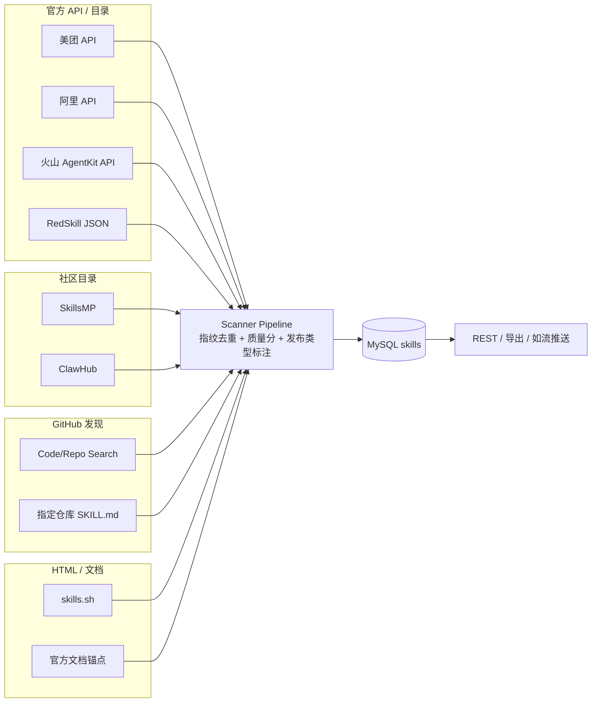

# 各公司 Skill 获取来源说明

> 文档日期：2026-06-22  
> 项目：SkillGetter（IKnow）  
> 配置入口：`config/sources.yaml`  
> Adapter 注册：`backend/app/adapters/__init__.py`  
> 目录按厂商分包：`adapters/{meituan,aliyun,bytedance,zhihu,xiaohongshu,bilibili,kuaishou,didi,pinduoduo,ctrip,tencent}/`；共用工具在 `adapters/common/`；补充源在 `adapters/supplemental/`。Services 按职责分包：`scan/`、`export/`、`ranking/`、`push/`、`enrichment/`。

本文档汇总各 **公司（vendor）** 的 Skill 是从哪里、通过什么方式抓取的，以及数据可信度、所需凭证与已知限制。

---

## 一、总览

| 公司 | source_id | Adapter | 主要数据来源 | 抓取方式 | 扫描间隔 | 当前入库量* |
|------|-----------|---------|--------------|----------|----------|-------------|
| 美团 | `meituan_ai_hub` | `meituan` | 美团 AI Hub API + SkillsMP 社区补充 | JSON REST + SkillsMP | 300s | 43+ |
| 阿里 | `aliyun_skills_portal` | `aliyun_skills` | 阿里 Skills 门户 API + SkillsMP 社区补充 | JSON REST + SkillsMP | 600s | 159+ |
| 字节 | `volcengine_find` | `volcengine_find` | AgentKit API + GitHub + SkillsMP + 官方文档 | OpenAPI + GitHub + SkillsMP | 600s | 110+ |
| 知乎 | `zhihu_skills` | `zhihu_skills` | ClawHub + SkillsMP + GitHub + 官方开发者入口 | 多源 REST + GitHub | 900s | ~495 |
| 小红书 | `xiaohongshu_red_skill` | `xiaohongshu_red_skill` | RedSkill 目录 + SkillsMP + GitHub | JSON + SkillsMP + GitHub | 900s | 168+ |
| 哔哩哔哩 | `bilibili_skills` | `bilibili_skills` | ClawHub + SkillsMP + GitHub + 官方开放平台 | 多源 REST + GitHub | 900s | — |
| 快手 | `kuaishou_skills` | `kuaishou_skills` | ClawHub + SkillsMP + GitHub + 官方开放平台 | 多源 REST + GitHub | 900s | — |
| 滴滴 | `didi_skills` | `didi_skills` | 官方 MCP + didi-ride-skill + ClawHub + SkillsMP + GitHub | 多源 REST + GitHub | 900s | — |
| 拼多多 | `pinduoduo_skills` | `pinduoduo_skills` | 官方开平 + MCP + ClawHub + SkillsMP + GitHub | 多源 REST + GitHub | 900s | — |
| 携程 | `ctrip_skills` | `ctrip_skills` | 官方 Wendao/TripGenie + ClawHub + SkillsMP + GitHub | 多源 REST + GitHub | 900s | — |
| 得物 | `dewu_skills` | `dewu_skills` | 官方 DOP + ClawHub + SkillsMP + GitHub | 多源 REST + GitHub | 900s | — |
| 腾讯 | `wechat_skillhub` | `wechat_skillhub` | 微信/CloudBase/企微 + ClawHub + SkillsMP + GitHub | 多源 REST + GitHub | 900s | — |
| 海外社区 | `skills_sh` | `skills_sh` | skills.sh 网站 | HTML 解析 | 1800s | 844 |
| GitHub | `github_watch` | `github_watch` | 指定仓库 + 全局 SKILL.md 搜索 | GitHub API | 3600s | 36 |

\* 当前入库量为文档编写时 `GET /api/stats/vendors` 快照，随扫描波动。

**国内一键导出（ZIP）包含**：美团、阿里、字节、知乎、小红书、哔哩哔哩、快手、滴滴、拼多多、携程、得物、腾讯。

**导出 / 如流推送新增字段**（2026-06）：

| 字段 | 说明 |
|------|------|
| **发布类型** | `官方发布` 或 `个人创作者` |
| **数据来源** | 如 `美团AI Hub API`、`SkillsMP`、`RedSkill目录`、`ClawHub`、`GitHub社区` 等 |

分类逻辑见 `backend/app/services/enrichment/skill_classification.py`；入库时由 Pipeline 写入 `metadata_json.publisherType` / `dataSource`。

**社区 Skill 厂商定向审核（2026-06）**：SkillsMP / ClawHub 检索结果在入库前经 DeepSeek 判定是否真正面向该厂商生态；多平台剪贴板工具、人物语录类等由启发式直接拒绝。见 `backend/app/services/enrichment/vendor_relevance.py`。

---

## 二、国内公司详情

### 2.1 美团

| 项 | 说明 |
|----|------|
| **展示名称** | 美团 AI Hub Skill 列表 |
| **官方页面** | https://developer.meituan.com/ai-hub/skill-list |
| **数据 API** | `https://developer.meituan.com/api/v4/front/skill/service/list` |
| **实现文件** | `backend/app/adapters/meituan/adapter.py` |
| **抓取逻辑** | 分页 GET 官方 API（`pageNo` 1–5）；再按 vendor 关键词从 **SkillsMP** 分页补充社区 Skill（`catalog: skillsmp`） |
| **数据可信度** | ⭐⭐⭐⭐⭐ 官方 API 为主；SkillsMP 为社区策展补充 |
| **所需凭证** | 无（公开接口） |
| **字段** | 名称、描述、分类、安装量、详情链接等 |

---

### 2.2 阿里

| 项 | 说明 |
|----|------|
| **展示名称** | 阿里云 Agent Skills 门户 |
| **官方页面** | https://skills.aliyun.com |
| **数据 API** | `https://skills.aliyun.com/api/public/skills` |
| **实现文件** | `backend/app/adapters/aliyun/adapter.py` |
| **抓取逻辑** | 单次 GET 官方 API（`page=1`, `pageSize=500`）；再按 vendor 关键词从 **SkillsMP** 补充（2 页） |
| **数据可信度** | ⭐⭐⭐⭐⭐ 官方 API 为主；SkillsMP 为社区策展补充 |
| **所需凭证** | 无（公开接口） |
| **字段** | `skillName`、`displayName`、`categoryName`、`description`、`totalInstallCount`、版本等 |

---

### 2.3 字节（火山引擎 / 扣子 / GitHub）

| 项 | 说明 |
|----|------|
| **展示名称** | 字节跳动 Skill 生态（火山/扣子/GitHub） |
| **文档入口** | https://www.volcengine.com/docs/86681/2155845 |
| **实现文件** | `backend/app/adapters/bytedance/adapter.py`（yaml 中 adapter 名为 `volcengine_find`）<br>`backend/app/adapters/bytedance/agentkit.py`（AgentKit API 客户端） |

**数据来源（多路聚合，按优先级）：**

1. **火山 AgentKit 官方 API（主源）**
   - 接口：`ListSharingSkills`（OpenAPI，版本 `2025-10-30`）
   - Host：`agentkit.cn-beijing.volcengineapi.com`
   - 签名：Volcengine SignerV4（AK/SK）
   - 环境变量：`VOLCENGINE_ACCESS_KEY`、`VOLCENGINE_SECRET_KEY`、`VOLCENGINE_REGION`（默认 `cn-beijing`）
   - 无凭证时跳过，不影响其他子源

2. **官方 GitHub 仓库**
   - `volcengine/volcengine-skills`（含 volcengine-api、volcengine-cli、vefaas 等 12+ 子 skill）
   - 扫描 `skills/` 目录下各 `SKILL.md`

3. **GitHub Code Search（需 Token）**
   - 查询：`org:volcengine filename:SKILL.md`、`org:coze-dev filename:SKILL.md`、`coze skill filename:SKILL.md`

4. **GitHub Repo Search**
   - 查询：`volcengine skill`、`coze skill agent`、`bytedance agent skill`

5. **官方文档锚点（无 list API 时的入口 Skill）**
   - 火山 AgentKit Skills 中心、预置 Skill 目录
   - 扣子 Coze 开放平台、Coze Studio 开源版

6. **SkillsMP 社区补充**
   - 共享模块 `skillsmp_catalog.py`，按 `volcengine/coze/扣子/字节` 关键词检索（3 页）
   - 标记 `catalog: skillsmp`，发布类型为 **个人创作者**

| 数据可信度 | ⭐⭐⭐⭐ AgentKit API + 官方 GitHub 较完整；SkillsMP / 社区 GitHub 为补充 |
| 所需凭证 | **推荐** 配置 Volcengine AK/SK；**推荐** `GITHUB_TOKEN` 提高 GitHub 搜索额度 |

---

### 2.4 知乎

| 项 | 说明 |
|----|------|
| **展示名称** | 知乎 Agent Skills 社区 |
| **官方平台** | https://developer.zhihu.com（数据开放平台，REST / Skill / MCP） |
| **实现文件** | `backend/app/adapters/zhihu/adapter.py`<br>`backend/app/adapters/zhihu/catalog.py`（ClawHub / SkillsMP）<br>`backend/app/adapters/common/platform_filters.py` |

**数据来源（按优先级）：**

1. **ClawHub 技能市场（主源之一）**
   - API：`GET https://clawhub.ai/api/v1/search?q=zhihu&nonSuspiciousOnly=true`
   - 查询词：`zhihu`、`知乎`、`zhihu hot`、`zhihu publish`
   - 收录 `clawhub:{slug}`，含 zhihu-cli、maxhub-zhihu、zhihu-assistant 等

2. **SkillsMP 导航目录**
   - API：`GET https://skillsmp.com/api/v1/skills/search?q=zhihu&sortBy=stars`
   - 可选环境变量：`SKILLSMP_API_KEY`（提高日配额）
   - 收录 `skillsmp:{id}`，跳过 `zhihu-plus-plus` 等客户端工程维护类仓库

3. **知乎官方开发者入口（锚点）**
   - 数据开放平台、文档中心、热榜/问答 API、AI Bot OpenAPI
   - 专栏生态说明：https://zhuanlan.zhihu.com/p/1997469097856890798

4. **精选 GitHub 仓库**
   - `handsomestWei/zhihu-fetch-skill`、`liyxianren/zhihu`、`liuboacean/zhihu-automation-skill`

5. **GitHub Code / Repo Search（需 Token）**
   - 路径或仓库名须含 `zhihu` / `知乎`，并通过平台过滤

**过滤规则：**

- 路径/名称/描述须含 `zhihu` 或 `知乎`，或来自 ClawHub/SkillsMP 知乎检索、知乎专用仓库
- 黑名单仓库（如 `nexu-io/html-anything`）禁止整仓污染

**metadata.catalog 字段**：`clawhub` | `skillsmp` | `github` | `official`

| 数据可信度 | ⭐⭐⭐⭐ ClawHub/SkillsMP 策展 + 官方开发者入口；GitHub 为补充 |
| 所需凭证 | **推荐** `GITHUB_TOKEN`；可选 `SKILLSMP_API_KEY` |

---

### 2.5 小红书

| 项 | 说明 |
|----|------|
| **展示名称** | 小红书 RED Skill |
| **目录站点** | https://redskill.org/ |
| **实现文件** | `backend/app/adapters/xiaohongshu/adapter.py`<br>`backend/app/adapters/common/platform_filters.py` |

**数据来源（按优先级）：**

1. **RedSkill 官方目录 JSON（主源）**
   - URL：`https://redskill.org/data/redskill-xiaohongshu-cases.json`
   - 字段：`slug`、`name`、`category`、`description`、`installs`、`installCommand`、`sourceUrl`、`risk` 等
   - 约 135+ 条 ClawHub 公开小红书 Skill 快照

2. **RedSkill 精选 GitHub Cases**
   - 同上 JSON 中的 `githubCases[]`（官方策展的 GitHub 仓库）

3. **官方说明锚点**
   - 小红书 RED Skill 官方分发、Skill 上传规范

4. **精选 GitHub 社区仓库（补充）**
   - 如 `autoclaw-cc/xiaohongshu-skills`、`autoclaw-cc/xiaohongshu-mcp-skills`、`chenxiachan/xhs-claude-skills` 等
   - 目录可用时仅扫描前 3 个核心仓库；目录不可用时扩大 Code/Repo 搜索

5. **GitHub Code Search（目录不可用时的兜底，需 Token）**
   - `filename:SKILL.md xiaohongshu` / `redbook` / `小红书`

6. **SkillsMP 社区补充**
   - 共享模块 `skillsmp_catalog.py`，按 `xiaohongshu/小红书/redbook` 关键词检索（3 页）
   - 标记 `catalog: skillsmp`，发布类型为 **个人创作者**

**过滤规则：**

- RedSkill 目录条目直接收录
- GitHub 条目须含 `xhs|xiaohongshu|redbook|小红书` 等关键词，或来自小红书专用仓库
- 排除评测/无关仓库（如 `MalSkillBench`）

| 数据可信度 | ⭐⭐⭐⭐ 以 RedSkill 目录为主；SkillsMP / GitHub 为社区补充 |
| 所需凭证 | 无（RedSkill JSON 公开）；SkillsMP 可选 `SKILLSMP_API_KEY`；GitHub **推荐** `GITHUB_TOKEN` |

---

### 2.7 哔哩哔哩

| 项 | 说明 |
|----|------|
| **展示名称** | 哔哩哔哩 Agent Skills 社区 |
| **官方平台** | https://open.bilibili.com/ （开放平台，无公开 Skill 列表 API） |
| **实现文件** | `backend/app/adapters/bilibili/adapter.py`<br>`backend/app/adapters/bilibili/catalog.py`（ClawHub / SkillsMP） |

**调研结论（2026-06）：**

- **无官方 SkillHub**：B站开放平台提供视频/专栏/直播/数据等 REST API（OAuth 2.0），但**没有**类似美团 AI Hub 的 Skill 列表 API
- **社区目录为主**：SkillsMP、ClawHub 可检索到大量 B 站相关 Skill（上传、下载、字幕、热榜、UP主分析等）
- **GitHub/MCP 生态**：`bilibili-mcp`、`BiliStalkerMCP`、`yutto` 下载 skill、`social-auto-upload/bilibili-upload` 等

**数据来源（按优先级）：**

1. **ClawHub** — `bilibili` / `哔哩哔哩` / `b站` 检索，经 LLM 定向审核
2. **SkillsMP** — 关键词 `bilibili/哔哩哔哩/b站`，4 页，去重 + LLM 审核
3. **精选 GitHub 仓库** — BiliStalkerMCP、yutto、social-auto-upload 等
4. **GitHub Code / Repo Search** — `filename:SKILL.md bilibili` 等
5. **官方开放平台锚点** — 开平文档、视频/直播 API 说明、社区生态说明

| 数据可信度 | ⭐⭐⭐ 无官方 Skill 列表；社区目录 + GitHub 为主 |
| 所需凭证 | **推荐** `GITHUB_TOKEN`；**推荐** `DEEPSEEK_API_KEY`（LLM 审核）；可选 `SKILLSMP_API_KEY` |

---

### 2.8 快手

| 项 | 说明 |
|----|------|
| **展示名称** | 快手 Agent Skills 社区 |
| **官方平台** | https://open.kuaishou.com/ （开放平台 + 小程序开平，无公开 Skill 列表 API） |
| **实现文件** | `backend/app/adapters/kuaishou/adapter.py`<br>`backend/app/adapters/kuaishou/catalog.py`（ClawHub / SkillsMP） |

**调研结论（2026-06）：**

- **无官方 SkillHub**：快手开放平台提供短视频/直播/电商/本地生活等 REST API（OAuth），小程序开平提供能力申请文档，但**没有**类似美团 AI Hub 的统一 Skill 列表 API
- **社区目录为主**：SkillsMP、ClawHub 可检索到快手相关 Skill（上传、数据查询、热榜、链接解析等）
- **GitHub 生态**：`maxhub-kuaishou`（MaxHub API 38 端点）、`social-auto-upload/kuaishou-upload`、`httprunner/resolve-kwai-cdn-url` 等
- **第三方 Skill 商店**：SkillStore、SkillHub.cn、ai-skills.ai 等有快手运营/数据类 Skill，本系统通过 ClawHub/SkillsMP/GitHub 间接覆盖

**数据来源（按优先级）：**

1. **ClawHub** — `kuaishou` / `快手` / `kwai` / `maxhub-kuaishou` 检索，经 LLM 定向审核
2. **SkillsMP** — 关键词 `kuaishou/快手/kwai`，4 页，去重 + LLM 审核
3. **精选 GitHub 仓库** — maxhub-api-skills、social-auto-upload、httprunner/skills
4. **GitHub Code / Repo Search** — `filename:SKILL.md kuaishou` 等
5. **官方开放平台锚点** — 开平文档、小程序能力、视频/电商 API、社区生态说明

| 数据可信度 | ⭐⭐⭐ 无官方 Skill 列表；社区目录 + GitHub 为主 |
| 所需凭证 | **推荐** `GITHUB_TOKEN`；**推荐** `DEEPSEEK_API_KEY`（LLM 审核）；可选 `SKILLSMP_API_KEY` |

---

### 2.9 滴滴

| 项 | 说明 |
|----|------|
| **展示名称** | 滴滴 Agent Skills 社区 |
| **官方平台** | https://mcp.didichuxing.com/ （DiDi MCP 服务 + 官方 Skill，无公开 Skill 列表 API） |
| **实现文件** | `backend/app/adapters/didi/adapter.py`<br>`backend/app/adapters/didi/catalog.py`（ClawHub / SkillsMP） |

**调研结论（2026-06）：**

- **有官方 Skill，无 Skill 列表 API**：滴滴 2025–2026 年推出 **DiDi MCP**（13 个工具：打车全流程 + 地图路线），并发布官方 **`didi-ride-skill`**（GitHub + ClawHub `didi-ride-skill-official`），但**没有**可分页拉取的 Skill 目录 API
- **官方入口明确**：MCP 官网直接列出 Skill 安装方式（`clawhub install didi-ride-skill-official`）
- **社区体量较小**：相比 B 站/快手，第三方衍生 Skill 较少；SkillsMP/ClawHub 检索以官方包及 MCP 封装为主
- **需过滤**：多平台导航/剪贴板工具中「顺带支持滴滴」的条目由 LLM 审核拒绝

**数据来源（按优先级）：**

1. **官方锚点** — MCP 平台、API 文档、ClawHub/GitHub 官方 Skill 链接
2. **GitHub 官方仓库** — `didi/didi-ride-skill`（标记 `official_github`）
3. **ClawHub** — `didi` / `滴滴` / `didi-ride` / `didichuxing` 检索 + LLM 审核
4. **SkillsMP** — 关键词 `didi/滴滴/didichuxing`，4 页
5. **GitHub Code / Repo Search** — `filename:SKILL.md didi-ride` 等

| 数据可信度 | ⭐⭐⭐⭐ 有官方 Skill + MCP；社区条目少但质量高 |
| 所需凭证 | **推荐** `GITHUB_TOKEN`；**推荐** `DEEPSEEK_API_KEY`；可选 `SKILLSMP_API_KEY` |

---

### 2.10 拼多多

| 项 | 说明 |
|----|------|
| **展示名称** | 拼多多 Agent Skills 社区 |
| **官方平台** | https://open.pinduoduo.com/ （开放平台，无公开 Skill 列表 API） |
| **实现文件** | `backend/app/adapters/pinduoduo/adapter.py`<br>`backend/app/adapters/pinduoduo/catalog.py` |

**调研结论（2026-06）：**

- **无官方 SkillHub**：拼多多开放平台提供订单/商品/物流/多多进宝等 REST API，但**没有**统一 Skill 目录 API
- **社区 Skill**：ClawHub `pdd-coupon-bot`（优惠券/百亿补贴）、`mcp-cn-commerce` 的 `mcp-cn-pinduoduo` MCP 模块
- **需过滤**：`cn-ecommerce-search` 等 8 平台统一搜索、多平台剪贴板工具

**数据来源**：官方开平锚点 → GitHub（mcp-cn-commerce）→ ClawHub → SkillsMP → GitHub 搜索

| 数据可信度 | ⭐⭐⭐ 开平 API 明确；社区以 MCP/优惠券 Skill 为主 |
| 所需凭证 | **推荐** `GITHUB_TOKEN`；**推荐** `DEEPSEEK_API_KEY`；可选 `SKILLSMP_API_KEY` |

---

### 2.11 携程

| 项 | 说明 |
|----|------|
| **展示名称** | 携程 Agent Skills 社区 |
| **官方平台** | https://www.ctrip.com/wendao/openclaw （问道 OpenClaw）；https://www.trip.com/tripgenie/openclaw （TripGenie） |
| **实现文件** | `backend/app/adapters/ctrip/adapter.py`<br>`backend/app/adapters/ctrip/catalog.py` |

**调研结论（2026-06）：**

- **官方 OpenClaw Skill（2 个）**：`wendao-skill`（携程问道，Token 页 ctrip.com/wendao/openclaw）、`tcom-tripgenie-skill`（TripGenie，trip.com/tripgenie/openclaw）；无公开 Skill 列表 API
- **企业商旅 MCP**：携程商旅 AI 开放平台（ct.ctrip.com）面向企业对接，无个人开发者公开 MCP 注册
- **社区目录**：ClawHub API 约 15–22 条 slug（`ctrip*`、`wendao*`、`tripgenie*`）；SkillsMP 原始命中 ~200+，经关键词+LLM 审核后约 25–35 条有效 Skill
- **GitHub 生态**：`yflaz/ctrip-skill`、`openclaw/skills` 下 `ctrip-flight-sunrise`/`flight-monitor`、`ovesorg/workbuddy-config/connectors/ctrip-wendao` 等
- **需过滤**：`trip.com` 泛搜噪声大（tripwire/roundtrip 等）；不用 `trip.com` 作为 SkillsMP 主检索词

**数据来源（优先级）**：

1. **官方锚点** — Wendao / TripGenie OpenClaw、Trip.Planner、Connect 开平、商旅 AI 说明
2. **ClawHub** — `ctrip` / `携程` / `wendao` / `tripgenie` / `ctrip-flight` 等 + 直接 slug 拉取官方包
3. **SkillsMP** — `ctrip/携程/wendao/问道/tripgenie/ctrip-flight/ctrip-hotel`，4 页
4. **GitHub** — `yflaz/ctrip-skill`、`workbuddy-config/ctrip-wendao` + Code/Repo Search
5. **跨源去重** — `record_dedup.py` 合并 ClawHub/SkillsMP/GitHub 重复条目

| 数据可信度 | ⭐⭐⭐⭐ 有 2 个官方 OpenClaw Skill；社区以机票监控/酒店比价为主 |
| 所需凭证 | **推荐** `GITHUB_TOKEN`；**推荐** `DEEPSEEK_API_KEY`；可选 `SKILLSMP_API_KEY` |

---

### 2.12 腾讯

| 项 | 说明 |
|----|------|
| **展示名称** | 腾讯 Agent Skills 社区 |
| **官方文档** | https://developers.weixin.qq.com/miniprogram/dev/ai/guide.html |
| **实现文件** | `backend/app/adapters/tencent/adapter.py`<br>`backend/app/adapters/tencent/catalog.py` |

**调研结论（2026-06）：**

- **无全局 Skill 列表 API**：小程序 AI 模式 Skill 在 `app.json → agent.skills[]`，按 App 私有配置
- **skillhub.cn** 为 ClawHub 镜像，通过 **ClawHub API** 收录（非独立官方目录）
- **官方枚举仓库**：`TencentCloudBase/skills`（~28）、`awesome-miniprogram-skills`（~14）、`WecomTeam/wecom-openclaw-plugin`（~15）
- **社区**：ClawHub wechat/tencent/wecom 检索 + SkillsMP（需强过滤 qq 用户名噪声）

**数据来源（优先级）：**

1. **ClawHub** — wechat/微信/tencent/腾讯/wecom/企业微信/hunyuan 等 + direct slugs
2. **SkillsMP** — 同上关键词，4 页，LLM 审核
3. **GitHub 枚举** — TencentCloudBase/*、WecomTeam/*、ai-mode-skills
4. **GitHub Code/Repo Search** — `repo:TencentCloudBase` 等
5. **官方锚点** — 小程序 AI 文档、CloudBase mp-skills、OpenClaw 微信/企微插件、ADP、MCP 广场

| 数据可信度 | ⭐⭐⭐ 官方 GitHub 枚举 + ClawHub 社区；无微信全站 Skill API |
| 所需凭证 | **推荐** `GITHUB_TOKEN`；**推荐** `DEEPSEEK_API_KEY`；可选 `SKILLSMP_API_KEY` |
| 导出 | 已纳入国内 CSV/ZIP 导出 |

---

## 三、补充源（非国内公司维度）

### 3.1 海外社区（skills.sh）

| 项 | 说明 |
|----|------|
| **source_id** | `skills_sh` |
| **网站** | https://skills.sh |
| **实现文件** | `backend/app/adapters/supplemental/skills_sh.py` |
| **抓取逻辑** | 爬取首页 + `/trending` + `/hot` + `/top`，BeautifulSoup 解析 `<a href>` 链接 |
| **标记** | `supplemental: true`（补充源，排行榜权重可能不同） |
| **导出** | 单独导出时包含 **安装量、质量分** 列（仅 skills.sh 源） |

---

### 3.2 GitHub（仓库监控）

| 项 | 说明 |
|----|------|
| **source_id** | `github_watch` |
| **实现文件** | `backend/app/adapters/supplemental/github_watch.py` |
| **监控仓库** | `anthropics/skills`、`vercel-labs/agent-skills`、`openai/skills` |
| **补充** | 全局 `filename:SKILL.md` Code Search（需 Token） |
| **标记** | `supplemental: true` |

---

## 四、环境变量与凭证

| 变量名 | 用途 | 影响范围 |
|--------|------|----------|
| `GITHUB_TOKEN` | GitHub API 鉴权，提高 rate limit | 字节、知乎、小红书、腾讯、GitHub 监控 |
| `SKILLSMP_API_KEY` | SkillsMP 目录 API 配额 | 美团、阿里、字节、知乎、小红书、哔哩哔哩、快手、滴滴、拼多多、携程（SkillsMP 分页抓取） |
| `VOLCENGINE_ACCESS_KEY` | 火山 AgentKit API | 字节（ListSharingSkills） |
| `VOLCENGINE_SECRET_KEY` | 火山 AgentKit API 签名 | 字节 |
| `VOLCENGINE_REGION` | 火山 API 区域（默认 cn-beijing） | 字节 |

配置文件：项目根目录 `.env`（参考 `.env.example`）。

---

## 五、数据流示意



---

## 六、发布类型与数据来源分类

入库时 `pipeline.py` 调用 `enrich_metadata()`，在 `metadata_json` 中写入：

| metadata 键 | 导出/推送列 | 取值示例 |
|-------------|-------------|----------|
| `publisherType` | 发布类型 | `官方发布` / `个人创作者` |
| `dataSource` | 数据来源 | `美团AI Hub API`、`SkillsMP`、`RedSkill目录` 等 |

**官方发布**（满足其一）：

- `catalog` 为 `official` / `official_api` / `official_github` / `redskill`
- metadata 标记 `official` / `redskill` / `agentkit`
- 来自美团 AI Hub、阿里 Skills 门户等官方 API（非 SkillsMP 条目）

**个人创作者**（满足其一）：

- `catalog` 为 `skillsmp` / `clawhub` / `github`
- `external_id` 前缀 `skillsmp:` / `clawhub:`

实现：`backend/app/services/enrichment/skill_classification.py`  
导出：`backend/app/services/export/skill_export.py`（CSV/XLSX 新增两列）  
推送：`backend/app/services/push/ruliu_notifier.py`（表格 8 列）

---

## 七、手动重扫（清理脏数据）

归档旧数据并重新抓取指定源：

```bash
curl -X POST http://localhost:8000/api/debug/resync-source/meituan_ai_hub
curl -X POST http://localhost:8000/api/debug/resync-source/aliyun_skills_portal
curl -X POST http://localhost:8000/api/debug/resync-source/volcengine_find
curl -X POST http://localhost:8000/api/debug/resync-source/zhihu_skills
curl -X POST http://localhost:8000/api/debug/resync-source/xiaohongshu_red_skill
curl -X POST http://localhost:8000/api/debug/resync-source/bilibili_skills
curl -X POST http://localhost:8000/api/debug/resync-source/kuaishou_skills
curl -X POST http://localhost:8000/api/debug/resync-source/didi_skills
curl -X POST http://localhost:8000/api/debug/resync-source/pinduoduo_skills
curl -X POST http://localhost:8000/api/debug/resync-source/ctrip_skills
curl -X POST http://localhost:8000/api/debug/resync-source/dewu_skills
curl -X POST http://localhost:8000/api/debug/resync-source/wechat_skillhub
```

---

## 八、覆盖率与已知缺口

| 公司 | 覆盖评估 | 主要缺口 |
|------|----------|----------|
| 美团 | 较完整 | 官方 API 完整；SkillsMP 补充社区创作者 Skill |
| 阿里 | 较完整 | 官方 API 完整；SkillsMP 补充社区创作者 Skill |
| 字节 | 较完整 | 无 AK/SK 时缺少 AgentKit；SkillsMP 补充社区 Skill |
| 知乎 | 较完整 | 无知乎专属 SkillHub；已接 ClawHub + SkillsMP + 官方开发者入口 |
| 小红书 | 较完整 | RedSkill 目录为主；SkillsMP 补充；官方 App 内 RED Skill 可能有延迟 |
| 哔哩哔哩 | 社区为主 | 无官方 SkillHub；已接 ClawHub + SkillsMP + GitHub + 开平锚点 |
| 快手 | 社区为主 | 无官方 SkillHub；已接 ClawHub + SkillsMP + GitHub + 开平锚点 |
| 滴滴 | 官方 MCP + Skill | 有 didi-ride-skill；无列表 API；已接 MCP 锚点 + GitHub + ClawHub + SkillsMP |
| 拼多多 | 社区 + 开平 | 无 SkillHub；已接开平锚点 + mcp-cn-pinduoduo + ClawHub + SkillsMP |
| 携程 | 官方 OpenClaw + 社区 | 有 Wendao/TripGenie 官方 Skill；无列表 API；已接 ClawHub + SkillsMP + GitHub |
| 得物 | 开平 + 稀疏社区 | 无官方 SkillHub；已接 DOP 锚点 + ClawHub + SkillsMP + GitHub（约 12 条） |
| 腾讯 | 社区 + 官方枚举 | 无全局 Skill API；已接 ClawHub + SkillsMP + TencentCloudBase/WeCom GitHub |
| 海外社区 | 中等 | HTML 解析，无结构化 API |
| GitHub | 抽样 | 仅监控 3 个主仓库 + 30 条 Code Search |

---

## 九、相关代码索引

| 文件 | 说明 |
|------|------|
| `config/sources.yaml` | 源配置（vendor、interval、adapter、priority） |
| `backend/app/adapters/base.py` | `SourceAdapter` 基类、`RawSkillRecord` |
| `backend/app/adapters/common/skillsmp_catalog.py` | SkillsMP 共享抓取（国内各 vendor 关键词过滤） |
| `backend/app/adapters/common/github.py` | GitHub SKILL.md 扫描、Code/Repo 搜索共用工具 |
| `backend/app/adapters/common/clawhub.py` | ClawHub 目录抓取共用工具 |
| `backend/app/adapters/zhihu/adapter.py` | 知乎多源 adapter |
| `backend/app/adapters/bilibili/adapter.py` | 哔哩哔哩多源 adapter |
| `backend/app/adapters/bilibili/catalog.py` | ClawHub / SkillsMP 目录抓取 |
| `backend/app/adapters/kuaishou/adapter.py` | 快手多源 adapter |
| `backend/app/adapters/kuaishou/catalog.py` | ClawHub / SkillsMP 目录抓取 |
| `backend/app/adapters/didi/adapter.py` | 滴滴多源 adapter |
| `backend/app/adapters/didi/catalog.py` | ClawHub / SkillsMP 目录抓取 |
| `backend/app/adapters/pinduoduo/adapter.py` | 拼多多多源 adapter |
| `backend/app/adapters/pinduoduo/catalog.py` | ClawHub / SkillsMP 目录抓取 |
| `backend/app/adapters/ctrip/adapter.py` | 携程多源 adapter |
| `backend/app/adapters/ctrip/catalog.py` | ClawHub / SkillsMP 目录抓取 |
| `backend/app/adapters/dewu/adapter.py` | 得物多源 adapter |
| `backend/app/adapters/dewu/catalog.py` | ClawHub / SkillsMP 目录抓取 |
| `backend/app/adapters/tencent/adapter.py` | 腾讯多源 adapter |
| `backend/app/adapters/tencent/catalog.py` | ClawHub / SkillsMP 目录抓取 |
| `backend/app/services/enrichment/skill_classification.py` | 发布类型 / 数据来源分类 |
| `backend/app/services/scan/pipeline.py` | 入库时 enrich metadata |
| `backend/app/services/scan/scanner.py` | 扫描调度、`adapter.fetch()` → 入库 |
| `backend/app/services/export/skill_export.py` | CSV/ZIP 导出（含发布类型、数据来源） |
| `backend/app/services/push/ruliu_notifier.py` | 如流推送表格（8 列） |
| `backend/app/api/debug.py` | `POST /api/debug/resync-source/{source_id}` |

---

*文档随 Adapter 实现更新；若某 API 地址或页面结构变更，需同步修改对应 Adapter 并重新 resync。*
