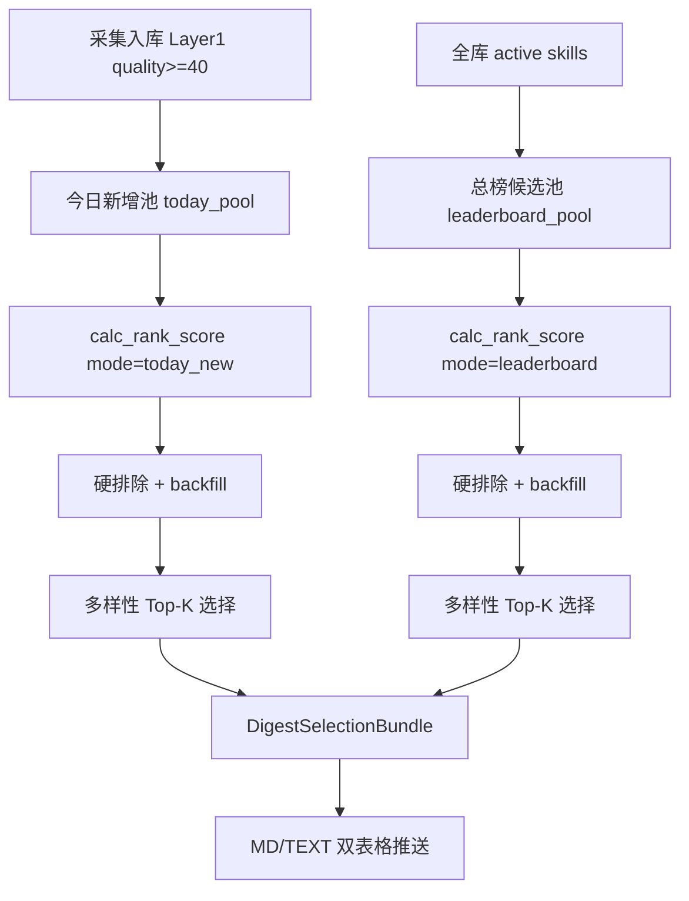

# 模块：排名精选算法（digest_selector）

> **模块名**：`digest_selector`  
> **代码路径**：`src/skill_radar/processors/digest_selector.py`  
> **配置路径**：`config/config.yaml` → `digest`  
> **版本**：v2（双榜：今日新增 + 当前总榜）

本文档公式使用标准 Markdown 数学块（`$...$` / `$$...$$`），流程图使用 Mermaid。在 GitHub、Typora、VS Code（启用数学预览）、Cursor 中均可正常渲染。

**读不懂公式？** 请先阅读 **[第 0 章：自然语言导读](#0-自然语言导读推荐先读)**，再用后面的公式章节当「精确版对照表」。

---

## 0. 自然语言导读（推荐先读）

这一章**不用公式**，把整个算法当成「编辑每天从两堆候选稿里各挑 8 条发稿」来理解。

### 0.1 这个算法到底在干什么？

SkillRadar 每天会从 skills.sh、GitHub 等渠道扫到**几百条** Skill，但如流消息有字数限制，用户也读不过来。  
算法的工作不是「全推」，而是回答两个问题：

1. **今天新发现了什么值得看的？** → 产出「今日新增 Top 8」
2. **现在全库里最火/最值得参考的是哪些？** → 产出「当前总榜 Top 8」

两榜各选 8 条，最后拼成一条 MD 双表格消息推给你。

可以把它想成两个独立的选题会：

| 选题会 | 稿件来源 | 选题标准 |
|--------|----------|----------|
| 今日新增 | 今天第一次入库的 Skill | 像「新闻编辑」：重质量、重首发、重分类清楚 |
| 当前总榜 | 数据库里所有较热门的 Skill | 像「热榜编辑」：重安装量，但也别太垃圾 |

---

### 0.2 从采集到推送：完整 6 步（产品视角）

```
第1步 采集          skills.sh / GitHub 拉数据
第2步 入库门槛      质量分 >= 40 的留下(active)，差的只存档(filtered)
第3步 准备两个池子  今日池(今天首次发现) + 总榜池(全库有安装量的)
第4步 给每条打分    今日池用「今日新增分」，总榜池用「总榜分」
第5步 过滤+精选     去掉不合格的，再按分数和多样性规则各挑 8 条
第6步 推送          渲染成 MD 双表格，发如流
```

**Layer 1（入库）和 Layer 2（推送精选）是分开的：**

- Layer 1 **宽进**：分数 ≥ 40 就进数据库，方便以后分析、调试台查看。
- Layer 2 **严选**：即使进了库，也不一定会被推到如流；推送还要再过一轮更严的算法。

---

### 0.3 两个候选池分别是什么？

#### 池子 A：今日新增池

- **怎么来的**：MySQL 里查 `first_seen_at = 今天` 且 `status = active` 的记录。
- **典型场景**：今天 skills.sh 榜单上新出现了 161 条，它们都在这个池子里。
- **注意**：同一个 Skill 只会出现在「今天」一次；明天就不再算「今日新增」。

#### 池子 B：当前总榜池

- **怎么来的**：MySQL 里查**全库** `active` 且 `install_count >= 50` 的记录，按安装量取前 800 条做候选。
- **典型场景**：库里已有 800+ 条有安装量数据的 Skill，从这里挑「当前最热」。
- **和今日池的关系**：总榜里可能有很久以前就入库的 Skill；今日池里某条 Skill 如果安装量够高，也可能同时出现在总榜里（但推送里会分两个表格展示，语义不同）。

---

### 0.4 打分：每条 Skill 怎么算出「推送分」？

打分就是给每条 Skill 算一个 **0～100 的推送分**。分数越高，越优先被选进 Top 8。  
分数由几块**加在一起**（有的榜还要**减掉**一些惩罚项）。

下面用自然语言说明每一块在问什么问题。

#### （1）基础质量分 ——「这条 Skill 像不像样？」（最高约 40 分）

在检查 Skill **本身**是否规范、信息是否完整，跟火不火关系不大。

| 检查项 | 加分/扣分 | 白话 |
|--------|-----------|------|
| 通过规范校验 `passes_spec` | +12 | 名字、描述等符合 agentskills 基本要求 |
| 描述够长 | +5～+10 | 描述 ≥40 字 +5；≥80 字 +10 |
| 描述是「真描述」 | +8 | 不是 skills.sh 那种模板句「Listed on skills.sh (trending) with 123 installs.」 |
| 描述是模板句 | -6 | 只有榜单快照、没有实质介绍 |
| 名字规范 | +5 | 如 `pdf-tool`，不是 `Bad Name` |
| 有 skill 路径 | +5 | 能定位到具体 skill 目录 |

**举例：**

- `frontend-design`（anthropics/skills），描述完整 → 基础质量分高。
- 某 azure 子 skill，描述只有「Listed on skills.sh...」→ 会被扣 6 分，今日新增榜严格模式下还可能直接被筛掉。

---

#### （2）热度分 ——「用的人多不多？」（今日榜最高约 25，总榜最高约 48）

看 `install_count`（skills.sh 安装量）和 `stars`（GitHub 星数）。

**关键设计：用对数，不用线性。**

- 安装量从 100 → 1000，加分很多（说明在快速变热）。
- 安装量从 200000 → 201000，加分很少（已经是头部了，不必再碾压别的条目）。

这样不会出现「安装量最高的 8 条霸占今日新增榜」的情况——今日榜还有别的维度在平衡。

**总榜**把热度权重开得更大（最高 48 分），因为总榜的定义就是「当前谁最火」。

---

#### （3）分类置信分 ——「我们能不能看懂它是干什么的？」（最高约 20 分）

看分类器给的 `categories` 和 `confidence`。

- 分类清楚（如 `engineering`、`devops`）且置信度高 → 接近满分。
- 标成 `uncategorized` 或 `needs_review`：
  - **今日新增榜**：几乎只给 0～3 分，严格模式下直接淘汰 —— 因为推送出去用户看不懂这条是干嘛的。
  - **总榜**：稍微宽松一点，允许「很火但还没分好类」的条目，最多给到 ~8 分。

---

#### （4）来源信任分 ——「从哪发现的，靠不靠谱？」（最高约 10 分）

| 来源 | 含义 | 倾向 |
|------|------|------|
| `github_watch` | 监控官方仓库 commit 发现 | 最可信 (+高) |
| `skills_sh_hot/trending` | 榜单热/趋势 | 较可信 |
| `github_search` | Code Search 搜到的新 SKILL.md | 中等 |
| 其他 | 未知来源 | 基础分较低 |

如果是 **官方 owner**（anthropics、vercel-labs 等），再 +3 分。

---

#### （5）新颖度分 ——「是不是「新发现」的情报？」（最高约 10，仅今日榜）

**只有今日新增榜才算这项。**

- 来自 `github_watch` 或 `github_search` → +8（像是「我们监控到的首发」）。
- 带 `trending` 标签 → 再 +2。

**意图**：同样都是今天入库，从 GitHub 监控挖出来的比 skills.sh 批量快照更有「情报价值」。

---

#### （6）地域加成 ——「是否国内 Skill？」（+0 或 +3，仅今日榜）

如果判定为国内（Gitee、国内 owner、描述含中文等），+3 分。  
配合后面的「国内至少选 2 条」配额使用（池子里有国内 Skill 时）。

---

#### （7）同源 repo 惩罚 ——「同一个仓库是不是已经占太多？」（减 0～15 分）

同一个 GitHub 仓库（如 `microsoft/azure-skills`）可能一次发布几十个 skill。  
在同一 repo 内，安装量排第 2、第 3 的 skill 会**减分**（第 1 名不罚，第 2 名 -6，第 3 名 -12…）。

**再配合规则「每个 repo 最多选 1 条进 Top 8」**，避免整页都是 azure-*。

---

### 0.5 `clamp` 是什么？（公式里经常出现）

`clamp(总分, 0, 100)` 的意思非常简单：

> 算完加减分后，**最低按 0 算，最高按 100 算**，别出现负数或超过 100。

**举例：**

- 某条加加减减后是 112 → 最终推送分 = **100**
- 某条算出来是 -5 → 最终推送分 = **0**

它不包含神秘逻辑，只是**封顶和保底**。

---

### 0.6 今日新增分 vs 总榜分：一句话区别

| | 今日新增分 | 总榜分 |
|---|-----------|--------|
| **核心问题** | 今天新发现的里，哪条最值得看？ | 全库当前哪条最火、最值得参考？ |
| **最看重** | 质量 + 新颖 + 分类 | 安装量（对数热度） |
| **新颖度** | 有 | 无 |
| **模板描述** | 严格排斥 | 较宽松 |
| **uncategorized** | 严格排斥 | 可 backfill 放宽 |
| **安装量门槛** | 无硬性最低安装 | 必须 ≥ 50 installs |

**今日新增分（白话版）：**

```
今日推送分 = 基础质量 + 热度(上限25) + 分类 + 来源信任 + 新颖度 + 国内加成 - 同源惩罚
然后 clamp 到 0~100
```

**总榜分（白话版）：**

```
总榜推送分 = 热度(上限48) + 基础质量×0.35 + 来源信任×0.8 + 分类×0.75 - 同源惩罚
然后 clamp 到 0~100
```

---

### 0.7 过滤：哪些条目连「候选」都进不了？

打分之后，不是所有人都进 Top 8 抽签，先要过**硬门槛**（像海选）：

**今日新增榜常见淘汰原因：**

- 推送分 < 55（默认门槛）
- 描述是 skills.sh 模板句（严格模式）
- 分类是 uncategorized / 需要复核
- confidence 太低（< 0.45）
- 在 blocklist 仓库里

**总榜额外要求：**

- 安装量必须 ≥ 50

---

### 0.8 Backfill：不够 8 条怎么办？

严格规则下，有时 161 条里可能 0 条能过（比如全是 uncategorized + 模板描述）。  
算法不会推空消息，而是**分 4 级逐步放宽**（每榜独立）：

| 级别 | 放宽什么 |
|------|----------|
| Level 0 | 最严格：分类差、模板描述都踢 |
| Level 1 | 允许 uncategorized / needs_review |
| Level 2 | 降低分数门槛（55→50→…）；允许模板描述 |
| Level 3 | 分数降到最低 40；同一 repo 最多可进 2 条 |

最终会记录用了哪一级：`selection_meta.today.backfill_level`。

**白话**：先按高标准选；选不满 8 条，就逐步「降低标准」凑够，但仍有分数底线和 repo 去重。

---

### 0.9 多样性精选：分数最高的前 8 名，还要再筛一轮

通过海选后，按推送分从高到低排序，但不是简单取前 8 —— 还要满足**多样性**：

| 规则 | 默认值 | 为什么 |
|------|--------|--------|
| 每个 repo 最多 1 条 | 1 | 不要 8 条全是 microsoft/azure-skills |
| 每个场景最多 3 条 | 3 | 不要全是 devops，要有 variety |
| 国内至少 2 条 | 2 | 国内有货时，推送要有国内代表（今日榜） |
| 官方至少 1～2 条 | 2/1 | 官方 Skill 优先曝光 |
| 同 repo 内名字太像 | 相似度≥0.85 视为重复 | 避免 azure-deploy / azure-ai 挤占 |

**同分怎么办？** 依次比：推送分 → 安装量 → stars → 置信度。

---

### 0.10 走一遍完整例子（简化）

假设今天今日新增池有 3 条（真实环境有 161 条，逻辑相同）：

| Skill | 来源 | 描述 | 安装量 | 分类 |
|-------|------|------|--------|------|
| A `git-commit` | github_watch | 完整描述 | 500 | engineering |
| B `azure-ai` | skills_sh | 模板描述 | 2500 | uncategorized |
| C `stripe-projects` | skills_sh | 完整描述 | 460 | collaboration |

1. **打分**  
   - A：质量高 + 新颖度 +8（github_watch）→ 推送分 ~75  
   - B：安装高但模板 + uncategorized → 推送分 ~45，严格模式**淘汰**  
   - C：质量 OK + 安装中等 → 推送分 ~62  

2. **海选**  
   - B 被刷掉；A、C 留下  

3. **多样性**  
   - A、C 不同 repo → 都可进榜  

4. **输出**  
   - 今日新增 Top 8 里包含 A、C（若不够 8 条则触发 backfill 从 B 这类里放宽补位）

总榜池则完全不同：安装量 207494 的 `azure-cost-optimization` 会因热度分极高排前，但每个 repo 仍只能占 1 个名额。

---

### 0.11 推送长什么样？

算法输出 `DailyDigest` 对象，包含：

- `today_skills`：今日新增 Top 8
- `leaderboard_skills`：当前总榜 Top 8
- `push_scores`：每条对应的推送分
- `selection_meta`：用了哪级 backfill、严格池大小等

通知模块 `format_digest_md` 渲染成两个 Markdown 表格，经如流 `msgtype=md` 发出。

---

### 0.12 和后面公式章节怎么对照读？

| 想搞懂的问题 | 先看本章 | 再看公式章 |
|--------------|----------|------------|
| clamp 是什么 | 0.5 | 第 3 章符号定义 |
| 安装量怎么换算成分 | 0.4(2) | 4.1 + 4.7 |
| 今日/总榜为何不同 | 0.6 | 第 5 章 |
| 为什么 azure 不再霸榜 | 0.4(7) + 0.9 | 4.6 + 第 8 章 |
| 161 条为何只推 16 条 | 0.7～0.9 | 第 6～8 章 |

---

## 1. 设计目标

SkillRadar 推送不是「把采集到的全部 Skill 列出」，而是从两个不同语义的数据池中**精选**少量高价值条目：

| 榜单 | 语义 | 候选池 | 用户价值 |
|------|------|--------|----------|
| **今日新增** | 今天第一次发现的 Skill | `first_seen_at = 日报日期` 且 `status=active` | 情报：今天有什么新东西 |
| **当前总榜** | 全库安装量/质量最高的 Skill | 全库 `active` 且 `install_count >= 阈值` | 参考：现在什么最火 |

两榜共用**多样性约束**（每 repo 最多 1 条等），但**评分公式不同**。

---

## 2. 总体流程



等价 ASCII 流程（不依赖 Mermaid 时参考）：

```
采集入库(Layer1) ──► 今日新增池 ──► 评分 S_new ──► 硬排除/backfill ──► Top-K ──┐
                                                                              ├──► 双榜推送
全库 active ──► 总榜候选池 ──► 评分 S_lb ──► 硬排除/backfill ──► Top-K ─────┘
```

---

## 3. 符号定义

对任意 Skill 记录 $s$，定义：

| 符号 | 含义 |
|------|------|
| $Q_{\text{base}}(s)$ | 基础质量分，区间 $[0, 40]$ |
| $Q_{\text{heat}}(s)$ | 热度分（安装量对数 + stars），上限可变 |
| $Q_{\text{class}}(s)$ | 分类置信分，区间 $[0, 20]$ |
| $Q_{\text{trust}}(s)$ | 来源信任分，区间 $[0, 10]$ |
| $Q_{\text{novelty}}(s)$ | 新颖度分，区间 $[0, 10]$ |
| $R(s)$ | 地域加成，取值 $\{0, 3\}$ |
| $P_{\text{repo}}(s)$ | 同源 repo 内排名惩罚，区间 $[0, 15]$ |
| $\mathrm{clamp}(x, a, b)$ | 截断到 $[a, b]$，即 $\max(a, \min(x, b))$ |

辅助函数（代码与公式一致）：

$$
\mathrm{clamp}(x, a, b) = \max\left(a,\ \min(x,\ b)\right)
$$

---

## 4. 子公式推导

### 4.1 安装量对数归一化 $L(n, \text{cap})$

原始安装量跨度极大（10 ~ 200000+），线性加权会被头部垄断。采用对数归一化：

$$
L(n,\ \text{cap}) = \min\left(\text{cap},\ \frac{\log_{10}(n+1)}{\log_{10}(N_{\text{ref}})} \times \text{cap}\right)
$$

其中：

- $n$ = `install_count`
- $N_{\text{ref}} = 500001$（覆盖 skills.sh 头部量级）
- $\text{cap}$ = 该分项上限

**推导意图**：$n$ 从 100 增至 1000 的边际收益，应大于从 100000 增至 100900，符合「热度感知」而非线性排名。

**Python 实现**：

```python
def log_norm_install(install_count, cap):
    if not install_count or install_count <= 0:
        return 0.0
    raw = math.log10(install_count + 1) / math.log10(500_001)
    return min(cap, raw * cap)
```

---

### 4.2 基础质量 $Q_{\text{base}}$

$$
Q_{\text{base}}(s) = \mathrm{clamp}\left(\sum_i w_i - p_{\text{template}},\ 0,\ 40\right)
$$

| 分项 | 条件 | 分值 |
|------|------|------|
| spec | `passes_spec=true` | +12 |
| desc | 描述长度 >= 80 字 / >= 40 字 | +10 / +5 |
| desc_real | 非 skills.sh 模板描述 | +8 |
| template | 命中模板句 | -6 |
| name | 符合 `[a-z0-9-]+` | +5 |
| path | `skill_path` 非空 | +5 |

模板句正则：

```regex
^Listed on skills\.sh\s*\([^)]+\)\s*with\s+\d+\s+installs\.?\s*$
```

**推导意图**：今日新增榜必须惩罚「只有榜单快照、无实质描述」的条目；总榜可放宽（见 5.2）。

---

### 4.3 分类置信 $Q_{\text{class}}$

**情况 A**：`uncategorized` 或 `needs_review`

- 今日新增：

$$
Q_{\text{class}}^{\text{today}}(s) = \min(3,\ 5 \times \text{confidence})
$$

- 总榜：

$$
Q_{\text{class}}^{\text{lb}}(s) = \min(8,\ 12 \times \text{confidence})
$$

**情况 B**：分类正常

$$
Q_{\text{class}}(s) = \min\left(20,\ 22 \times \text{confidence} + 2 \times \mathbb{I}_{\text{priorityCat}}\right)
$$

其中 $\mathbb{I}_{\text{priorityCat}} = 1$ 当 Skill 属于优先场景（engineering / data_ai / devops 等），否则为 0。

---

### 4.4 来源信任 $Q_{\text{trust}}$

$$
Q_{\text{trust}}(s) = \min\left(10,\ 0.7 \times \mathrm{trust}(\text{source}) + 3 \times \mathbb{I}_{\text{official}}\right)
$$

| source | trust(source) 基础值 |
|--------|---------------------|
| github_watch | 10 |
| skills_sh_hot / skills_sh_trending | 8 |
| skills_sh_top | 6 |
| github_search | 7 |
| gitee | 5 |
| 其他 | 3 |

$\mathbb{I}_{\text{official}} = 1$ 当 `is_official=true` 或 owner 在 `official_owners` 列表中。

---

### 4.5 新颖度 $Q_{\text{novelty}}$（仅今日新增使用）

$$
Q_{\text{novelty}}(s) = \min\left(10,\ 8 \times \mathbb{I}_{\text{freshSource}} + 2 \times \mathbb{I}_{\text{trendingTag}}\right)
$$

- $\mathbb{I}_{\text{freshSource}} = 1$ 当 `source` 为 `github_watch` 或 `github_search`
- $\mathbb{I}_{\text{trendingTag}} = 1$ 当 `source_tags` 含 `trending`

**推导意图**：监控仓库 / Code Search 发现的首发 Skill，比 skills.sh 批量快照更有「情报」价值。

---

### 4.6 同源惩罚 $P_{\text{repo}}$

对同一 `owner/repo` 内按安装量降序排名，第 $r$ 名（$r=0$ 为最高）：

$$
P_{\text{repo}}(r) = \min(15,\ 6r)
$$

**推导意图**：防止 `microsoft/azure-skills` 一次占满榜单；配合 `per_repo_max=1` 双保险。

---

### 4.7 热度分 $Q_{\text{heat}}$

$$
Q_{\text{heat}}(s,\ \text{cap}) = \min\left(\text{cap},\ L(n,\ 0.85 \times \text{cap}) + \min(\text{cap} \times 0.15,\ \log_{10}(\text{stars}+1) \times 2.5)\right)
$$

- 今日新增使用 $\text{cap} = 25$
- 总榜使用 $\text{cap} = 48$

---

## 5. 综合排名分 $S$

### 5.1 今日新增分 $S_{\text{new}}$

$$
\begin{aligned}
S_{\text{new}}(s) = \mathrm{clamp}\Big(
& Q_{\text{base}}(s)
+ Q_{\text{heat}}(s,\ 25)
+ Q_{\text{class}}^{\text{today}}(s) \\
& + Q_{\text{trust}}(s)
+ Q_{\text{novelty}}(s)
+ R(s)
- P_{\text{repo}}(s), \\
& 0,\ 100
\Big)
\end{aligned}
$$

**权重解读**（隐含在分项上限中）：

| 维度 | 约占比 |
|------|--------|
| 基础质量 $Q_{\text{base}}$ | ~40% |
| 热度 $Q_{\text{heat}}$ | ~25% |
| 分类 $Q_{\text{class}}$ | ~20% |
| 信任 + 新颖 | ~20% |

---

### 5.2 当前总榜分 $S_{\text{lb}}$

$$
\begin{aligned}
S_{\text{lb}}(s) = \mathrm{clamp}\Big(
& Q_{\text{heat}}(s,\ 48)
+ 0.35 \times Q_{\text{base}}(s) \\
& + 0.8 \times Q_{\text{trust}}(s)
+ 0.75 \times Q_{\text{class}}^{\text{lb}}(s)
- P_{\text{repo}}(s), \\
& 0,\ 100
\Big)
\end{aligned}
$$

**推导意图**：总榜以**安装量对数**为主信号（$Q_{\text{heat}}$ 最高 48 分），质量/分类为辅助。

**额外硬门槛**：

$$
\text{installCount} \ge \text{leaderboardMinInstalls} \quad (\text{默认 } 50)
$$

---

## 6. 硬排除规则（Hard Filters）

在进入 Top-K 选择前，候选必须满足：

| 规则 | 今日新增 | 总榜 |
|------|----------|------|
| 分数门槛 | $S_{\text{new}} \ge 55$（可 backfill 至 40） | $S_{\text{lb}} \ge 50$（可 backfill 至 40） |
| 非 blocklist repo | 是 | 是 |
| 非模板描述 | 严格模式：是 | 低分模板可剔除 |
| 非 uncategorized | 严格模式：是 | backfill 可放宽 |
| 非 needs_review | 严格模式：是 | backfill 可放宽 |
| confidence >= 0.45 | 严格模式：是 | backfill 可放宽 |
| install >= 50 | 不适用 | 是 |

---

## 7. Backfill 降级（凑满 K 条）

若严格池不足 `max_items`，逐级放宽：

| Level | 动作 |
|-------|------|
| 0 | 严格模式 |
| 1 | 放宽分类（允许 uncategorized / needs_review） |
| 2 | 分数门槛降低 `backfill_step`（默认 5）；允许模板描述 |
| 3 | 分数降至 `backfill_floor`（默认 40）；`per_repo_max + 1`（上限 3） |

每榜独立 backfill，元数据写入：

- `selection_meta.today.backfill_level`
- `selection_meta.leaderboard.backfill_level`

---

## 8. 多样性 Top-K 选择

在通过硬排除的候选池 $C$ 上，按 $S$ 降序贪心选取，约束：

| 约束 | 默认值 | 说明 |
|------|--------|------|
| per_repo_max | 1 | 每仓库最多 K 条 |
| per_category_max | 3 | 每场景最多 K 条 |
| domestic_min | 2 | 今日新增优先保证国内（有则选） |
| official_min | 2 / 1 | 今日新增 2，总榜 1 |
| name_similarity | 0.85 | 同 repo 内名称相似则视为重复 |

**Tie-breaker**（同分时的排序键，依次降序）：

$$
S \downarrow,\quad \text{installs} \downarrow,\quad \text{stars} \downarrow,\quad \text{confidence} \downarrow
$$

---

## 9. 与入库门槛的关系（Layer 1 vs Layer 2）

| 层级 | 配置 | 作用 |
|------|------|------|
| Layer 1 | `app.min_quality_score=40` | 宽进：写入 `active` / `filtered` |
| Layer 2 | `digest.*` | 严选：决定推送哪几条 |

推送条数：

$$
\text{pushedCount} = |\text{TodayTopK}| + |\text{LeaderboardTopK}|
$$

默认各 8 条；MD 消息上限 2048 字符。

---

## 10. 配置项一览

```yaml
digest:
  max_items_today: 8
  max_items_leaderboard: 8
  enable_today_section: true
  enable_leaderboard_section: true
  min_push_score: 55              # S_new 门槛
  leaderboard_min_push_score: 50  # S_lb 门槛
  leaderboard_min_installs: 50
  leaderboard_pool_limit: 800
  backfill_step: 5
  backfill_floor: 40
  per_repo_max: 1
  per_category_max: 3
```

---

## 11. 调用链

```text
Pipeline._build_digest
  ├─ Repository.list_skills_first_seen_on(date)  → today_pool
  ├─ Repository.list_active_skills_for_leaderboard() → lb_pool
  └─ select_digest_bundle(today_pool, lb_pool)
       ├─ select_ranked_skills(..., mode=today_new)
       └─ select_ranked_skills(..., mode=leaderboard)
            └─ RuliuNotifier._render_message → format_digest_md (双表格)
```

---

## 12. 调试与审计

- `selection_meta.today.backfill_level`：今日榜使用的降级级别
- `selection_meta.leaderboard.backfill_level`：总榜降级级别
- `push_scores[fingerprint]`：最终分数 $S$
- `DigestSelectionResult.breakdowns`：分项得分（代码内，可扩展落库）

本地预览：

```bash
python3 -m skill_radar debug
python3 -m skill_radar push --date 2026-06-16
```

---

## 13. 已知局限与后续

1. **分类器**：大量 `uncategorized` 时今日榜依赖 backfill，需扩充 `taxonomy.yaml`
2. **总榜偏 skills.sh 安装量**：GitHub 无 install 的 Skill 难进总榜
3. **MD 表格**：如流 MD 对 pipe table 渲染因客户端而异
4. **Phase 3**：远程 SKILL.md 深度校验，提升 $Q_{\text{base}}$ 精度

---

## 14. 变更记录

| 版本 | 变更 |
|------|------|
| v1 | 单榜 Top10，push_score 加权求和 |
| v2 | 双榜分离公式；对数安装量；模板惩罚；分项 breakdown |
| v2.1 | 文档公式改为 `$`/`$$` 标准语法；Mermaid 节点加引号；补充 ASCII 流程 |
| v2.2 | 新增第 0 章「自然语言导读」，逐项解释 clamp 与各评分维度 |
